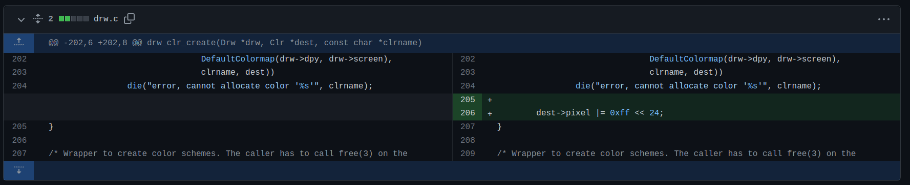
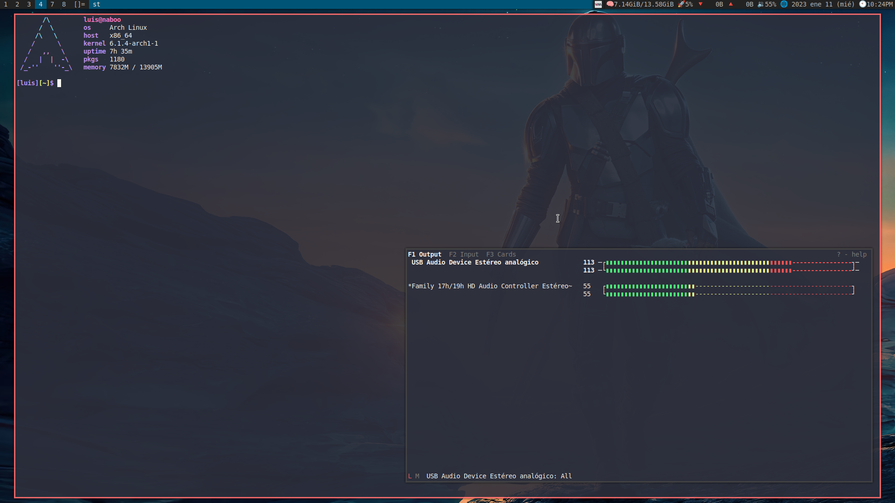

# My DWM Version for my laptop (tatooine)

## Requirements

Make sure the `libxft` package is installed in your system ([no longer needs `libxft-bgra` package](https://gitlab.freedesktop.org/xorg/lib/libxft/-/merge_requests/12)).

No longer needs the "patch" with color emojis since [16 sep commit](https://git.suckless.org/dwm/commit/970f37697358574e127019eb0ee2f5725ec05ce0.html).

## Patches

- [vanitygaps](https://dwm.suckless.org/patches/vanitygaps/).
- [alwayscenter](https://dwm.suckless.org/patches/alwayscenter/).
- shiftview and shiftviewclients from [shift tools](https://dwm.suckless.org/patches/shift-tools/).
- [actualfullscreen](https://dwm.suckless.org/patches/actualfullscreen/).
- [hide vacant tags](https://dwm.suckless.org/patches/hide_vacant_tags/).
- [systray](https://dwm.suckless.org/patches/systray/).

Also I fixed transparency border issue with this:

Thanks to [szatanjl](https://github.com/szatanjl/dwm/commit/1529909466206016f2101457bbf37c67195714c8?diff=split).

P.D.: Oh and don't forget to include `#include <X11/XF86keysym.h>` inside your config.def.h file in order to use your multimedia keys.

## How to update

Please search "Updating customizations after new release" in [dwm page](https://dwm.suckless.org/customisation/patches_in_git/).

## Screenshot

